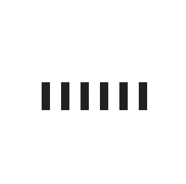

# bar-loader

## 알게 된 것들

- alernate : 정해진 순서로 진행했다가 반대 순서로 진행하기. 여기서 alternate를 제거하면, 다시 줄어들때 바로 줄어든다. 중간 단계를 거치지 않음.
- animation-delay에 양수와 음수 값을 지정할 수 있다. 음수는 이미 시작되고 경과된 지점으로 바로.
- translate에서 %는 해당 요소의 길이의 %를 말한다.
- 그래서 position absolute 설정 후 top과 bottom으로 50% 이동해서 중앙정렬을 해도 요소 길이 만큼 밀려나는데, 이것을 조정하기 위해 transform: translate(-50%, -50%); 을 해준다.

### 유튜브 채널

[opentutorials](https://www.youtube.com/channel/UCbwXnUipZsLfUckBPsC7Jog)
