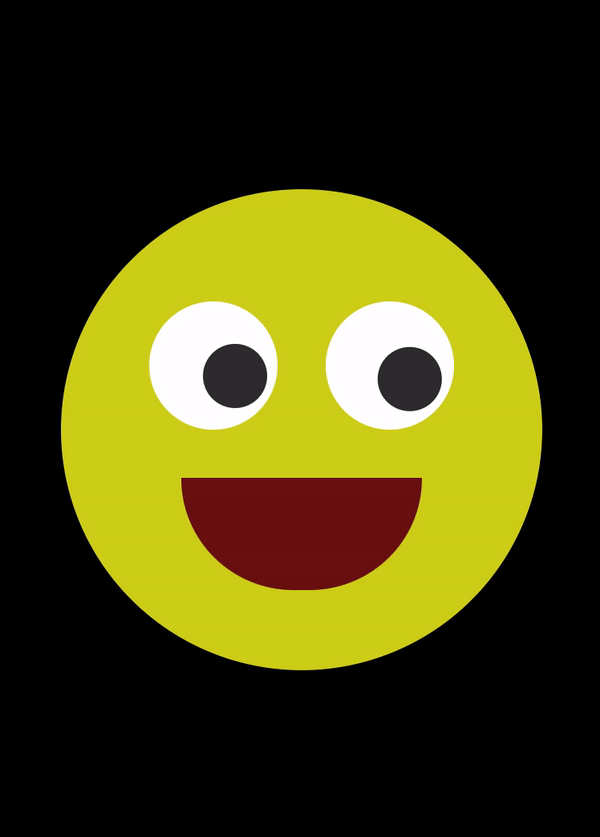

# follow-mouse-cursor

## 알게 된 것들

- ::before 는 선택한 요소의 첫 자식으로 의사 요소를 하나 생성. 보통 content 속성과 함께 요소에 장식용 콘텐츠를 추가할 때 사용함. 기본값은 인라인. :before도 같은 것.
- transition은 속성을 변경할 때 속도를 조절하는 것.

### 유튜브 채널

[opentutorials](https://www.youtube.com/channel/UCbwXnUipZsLfUckBPsC7Jog)
