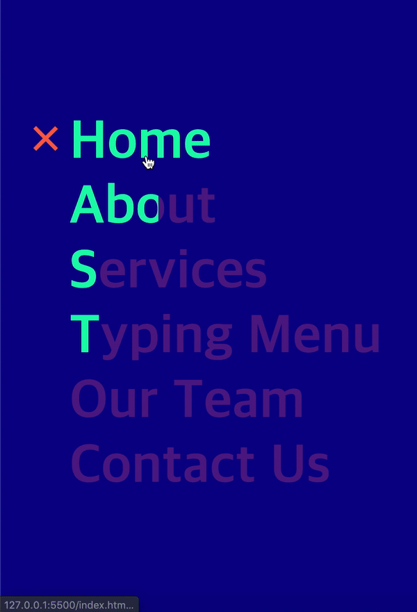

# typerwriter-animation

<div>

</div>

## 알게 된 것들

- relative, absolute가 헷갈렸었는데 개념을 이해했다. relative는 position을 따로 설정하지 않았을 때 기준으로 움직이고, absolute는 자신의 위로 positon이 relative, absolute, fixed 등 설정된 부모요소를 기준으로 움직인다.
- 여기서 x자 표시로 사용된 엔티티.

```html
&times;
```
