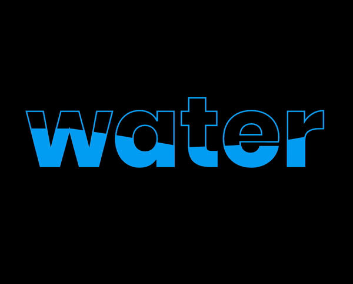

# water-wave-text-animation

## 알게 된 것들

- 유용한 사이트 [css clip-path maker](https://bennettfeely.com/clippy/)
- nth-child(n) 형제 요소들 중에 n번째 선택
- em은 상위요소의 크기를 기준으로, rem은 최상위 요소의 크기를 기준으로/
- 보통 16px이 기본값이다.
- ease-in-out은 전환효과가 천천히 시작되어, 천천히 끝난다.

### 유튜브 채널

[opentutorials](https://www.youtube.com/channel/UCbwXnUipZsLfUckBPsC7Jog)
