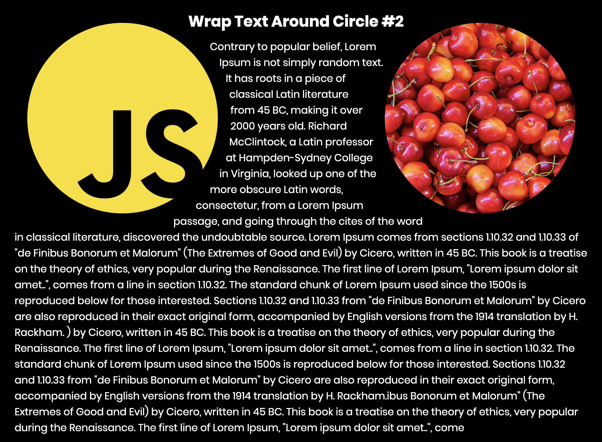

# wrap-text-circle

## 알게 된 것들

- shape-outside: circle();
- 인라인요소들에서 어떻게 wrap 할지.
- shape-outside: circle(50%); 와 같다.

### 유튜브 채널

[opentutorials](https://www.youtube.com/channel/UCbwXnUipZsLfUckBPsC7Jog)
